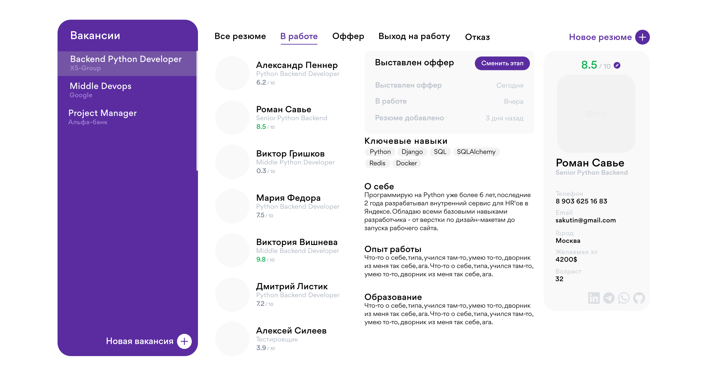

## Сloud CRM for automating recruitment and maintaining a candidate database.

### Backend:
- **API** - [FastAPI](https://fastapi.tiangolo.com).
- **ORM** - [SQLAlchemy](https://www.sqlalchemy.org).
- **Database** - [PostgreSQL](https://www.postgresql.org).
- **Data validation** - [Pydantic](https://docs.pydantic.dev).

### Frontend: 
_*(text will be added soon)_

### Other:
- 🐳 [Docker Compose](https://www.docker.com). _*(will be added no later than June 16, 2024)_
- ✅ **Tests** - [Pytest](https://pytest.org). _*(will be added no later than June 12, 2024)_
- 🔐 **Secure password** hashing by default.
- 🔑 **JWT** (JSON Web Token) authentication.
- 📫 Email based **password recovery**.

### Entities in project:
- User
- Vacancy 
- Resume
- Client (the one who issues orders for recruiting specialists). _*(will be added no later than June 20, 2024)_
- ...

### Project history/roadmap:
- ✅ Project init - 30.04.2024
- ✅ Add authentication | Add user, resume and vacancy entities - 02.05.2024
- ... 02.05.2024-29.05.2024 - many changes, start history from here.
- ✅ Hello Frontend 🌻 - 30.05.2024
- ✅ Add tests - 12.06.2024
- ✅ Add docker - 14.06.2024
- Project **v0.1.0** - first working version: register, login and crm pages ready - (exp 20.06.2024 - 1.07.2024)
- Add Client entity - (exp 20.06.2024 - 1.07.2024)

### LOGIN page

### CRM page
