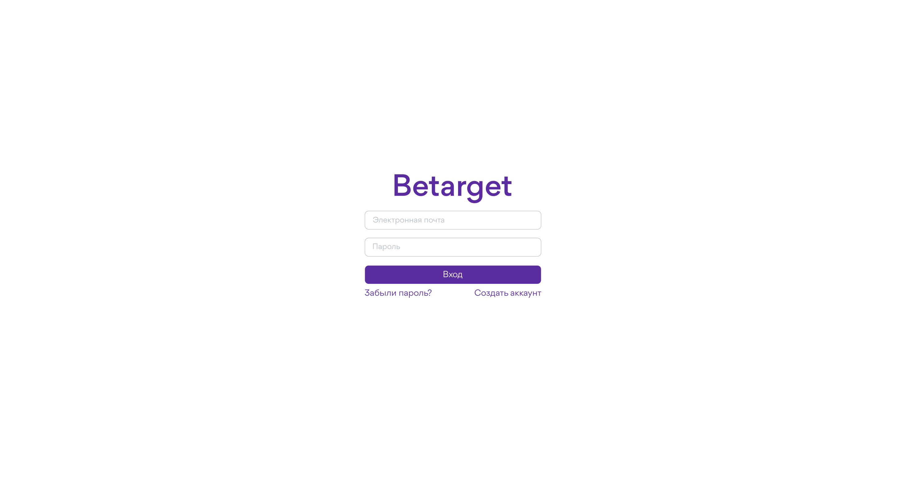
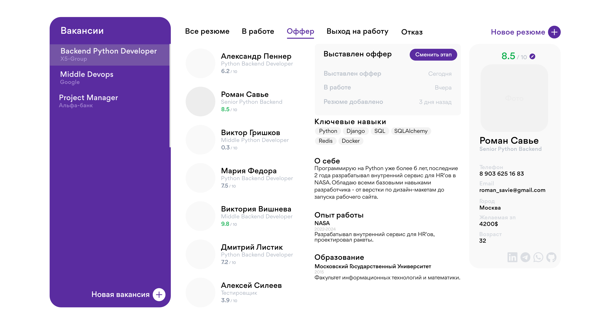

## Сloud CRM for automating recruitment and maintaining a candidate database.

### Backend:
- **API** - [FastAPI](https://fastapi.tiangolo.com).
- **ORM** - [SQLAlchemy](https://www.sqlalchemy.org).
- **Database** - [PostgreSQL](https://www.postgresql.org).
- **Data validation** - [Pydantic](https://docs.pydantic.dev).

### Frontend: 
- HTML, CSS, SCSS, JavaScript, Vue(in future)

### Other:
- 🐳 [Docker Compose](https://www.docker.com).
- ✅ **Tests** - [Pytest](https://pytest.org).
- 🔐 **Secure password** hashing by default.
- 🔑 **JWT** (JSON Web Token) authentication.
- 📫 Email based **password recovery**.

### Entities in project:
- User
- Vacancy 
- Resume
- Client (the one who issues orders for recruiting specialists). (exp 20.06.2024 - 1.07.2024)
- ...

### Project history/roadmap:
- ✅ Project init - 30.04.2024
- ✅ Add authentication | Add user, resume and vacancy entities - 02.05.2024
- .... 02.05.2024-29.05.2024 - many changes, start history from here.
- ✅ Hello Frontend 🌻 - 30.05.2024
- ✅ Add tests - 12.06.2024
- --- ✅ Auth
- --- ✅ Vacancy _in progress_
- --- Resume _in progress_
- ✅ Add docker - 14.06.2024
- Project **v0.1.0** - first working version: register, login and crm pages ready
- Client entity. (will be in project **v0.1.0**)
- Add GitHub Action for automated tests. (will be in project **v0.1.0**)
- Sending emails from crm. (will be in project **v0.2.0**)
- Sending messages from crm to: telegram, whatsapp, etc. (will be in project **v0.2.0**)
- Obtaining data from job search sites. (will be in project **v0.2.0**)
- English version. (will be in project **v0.2.0**)
- Integration with job search sites. (will be in project **v0.3.0**)
- Extension for browsers (will be in project **v0.4.0**-**v0.5.0**)

### LOGIN page

*will be in project v0.1.0

### CRM page

*will be in project v0.1.0
